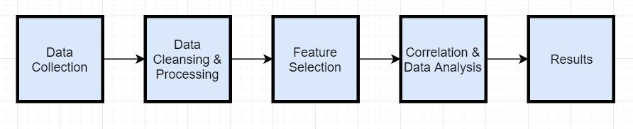

# SAR_Cellphone
## Project Name : Modeling Radiation Emitted from Cellphones
The purpose of this project is to find the correlations between specifications of cellphone and its SAR values. 
The below flow chart shows steps taken in the successful completion of the project.

## System Requirement: 
All the scripts were written in Jupyter Notebook for better visualization.You can download Anaconda Navigator/Jupyter Notebook or any software supporting python scripting. All the scripting is done and run in Python 3.6 enviroment.
## Library Requirement:
Try to load all the library for getting started with script. If any library is absent download using pip install/conda install in powershell/command prompt/anaconda prompt.
## File Lists:
### Script1 (Links for Cellphone-Website 1) 
Install request,BeautifulSoup libraries if not already install.This script will give you all the celphone model links.
'https://www.gsmarena.com/'
### Script 2 (Batch Data Processing 1)
This script takes output csv file of script 1 as input and does batch data processing. It goes on each and every link website(webpage) and collect all the specifications of cellphone and store it in tabular form in a new csv file.
'https://www.rfsafe.com/'
### Script3 (Links for Cellphone-Website 2)
Install Selenium and download firefox webdriver (geckodriver) and add the 'geckodriver' to the path(C:\User\..). This script will give you all the celphone model links.
### Script 4(Batch Data Processing 2)
This script takes output csv file of script 3 as input and does batch data processing. It goes on each and every link website(webpage) and collect all the specifications of cellphone and store it in tabular form in a new csv file.
## Analysis Results
### Script 5 (Specifications of cellphone VS SAR)
A sample of 200 datapoints were taken. This script gives correlation, OLS, Garient boosting algorithm, Ridge, Lasso, ElasticNet results for specifications of cellphone vs SAR value.
### Script 6 (Frequency & Power VS SAR) 
A sample of 132 datapoints were taken. This script gives correlation, OLS, Garient boosting algorithm, Ridge, Lasso, ElasticNet results for Frequency & Power VS SAR. The same code is ran for sperate Head_SAR.csv and Body_SAR.csv to get seperate results.

